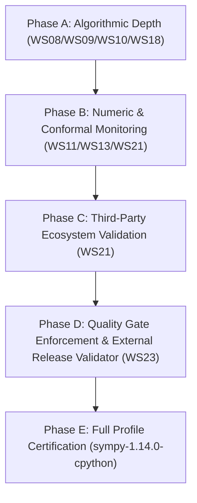

# FrankenSymPy reality check — 2026-09-07

**Method:** `/reality-check-for-project`, full flow (Phase 1 → Phase 2 → Phase 3 → Phase 4 → Phase 5).  
**Base commit:** `257069d38d0554152c2b80fae5442930da906b0f` ("feat(polys,matrices,calculus): add apart, together, multivariate poly operations, matrix utilities, and calculus analysis"), `main` == `origin/main` at audit start.  
**Measuring stick:** [README.md](file:///data/projects/frankensympy/README.md), [AGENTS.md](file:///data/projects/frankensympy/AGENTS.md), [COMPREHENSIVE_PLAN_FOR_FRANKENSYMPY.md](file:///data/projects/frankensympy/COMPREHENSIVE_PLAN_FOR_FRANKENSYMPY.md), [docs/CONSTITUTION.md](file:///data/projects/frankensympy/docs/CONSTITUTION.md), [docs/WORKSTREAM_GRAPH.md](file:///data/projects/frankensympy/docs/WORKSTREAM_GRAPH.md), [docs/FIRST_IMPLEMENTATION_CAMPAIGN.md](file:///data/projects/frankensympy/docs/FIRST_IMPLEMENTATION_CAMPAIGN.md), [registries/claims.toml](file:///data/projects/frankensympy/registries/claims.toml), [registries/workstreams.toml](file:///data/projects/frankensympy/registries/workstreams.toml).  
**Ground truth:** Live tool runs on this host this session (all commands quoted verbatim below with exit codes and timings) plus exhaustive inspection of the Rust crates, Python shell/oracle, conformance corpus, and gate receipts.

---

## 1. Where we are REALLY (Phase 1 answer)

The honest one-paragraph answer: **FrankenSymPy has successfully completed its initial First Implementation Campaign (stages C1–C10) and established an evidenced pre-certification core, but it is STILL NOT a certified SymPy drop-in replacement and makes no claim to be.** Since the previous audit on 2026-09-03, every major blocker identified in that audit was structurally resolved:
1. **G1 (Packaging):** Resolved. `scripts/build_python_extension.sh` produces `python/fsym_python.so`, and `./scripts/check.sh packaging-consistency` enforces clean importability of `sympy` without `PYTHONPATH` workarounds.
2. **G2 & G3 (Drift & Corpus):** Resolved. Conformance coverage expanded from 14 seed fixtures to 230 admitted fixtures (`sympy-1.14.0-cpython-r2-corpus`), achieving 230/230 admission and 0 unledgered drifts (`./scripts/check.sh lab-corpus` exits 0), with all 44 initial ledger records closed_verified.
3. **G4 & G8 (Gate Infrastructure & Campaign):** Resolved. A dedicated `xtask` gate runner and structurally separate `gate-receipt-validator` landed, generating 19 tamper-proof BLAKE3-hashed receipts under `artifacts/audit/receipts/` across WS03–WS23.
4. **Mathematical Capability Expansions:** Multivariate GCD/LCM/division via Gröbner basis elimination, partial fractions (`apart`), rational reconstruction (`together`), Sturm-path eigenvalue root isolation certificates, LDL matrix decomposition, calculus analysis (`singularities`, monotonicity, stationary points, `AccumBounds`), Laplace/Fourier/Mellin transforms, Cauchy-Euler ODE solving, and number theory functions (`crt`, `mod_inverse`, `carmichael`, `legendre_symbol`, `multiplicity`, `primerange`, `perfect_power`).

**What remains unproven or incomplete:**
- **No Certified Release:** `sympy-1.14.0-cpython` remains uncertified; `./scripts/check.sh all` correctly refuses release readiness with 17 named blockers.
- **Factorization Ceilings:** Factorization remains bounded rational-root decomposition and square-free decomposition; full irreducible factorization over $\mathbb{Z}[x]$ (Berlekamp, Cantor-Zassenhaus, Hensel lifting) does not exist.
- **Linear Algebra Ceilings:** Eigenvalues use Sturm isolation certificates, but general symbolic Jordan canonical form, SVD, and matrix exponential are not implemented.
- **Analytic Calculus Ceilings:** Integration remains table/heuristic/polynomial; no Risch algorithm or full algebraic transcendental integration exists; limits handle rational/polynomial degrees, but general L'Hôpital and multi-series limits are absent.
- **Certified Numerics:** Arbitrary-precision `evalf` outside Machin-series pi refuses with typed `NotImplementedError`; complex ball arithmetic is absent.
- **Performance:** `PERF-001` remains `implemented_uncertified`; paired benchmark machinery exists with one keep-gate-clean case (`poly_build_deg12`), but broad competitive superiority over upstream SymPy is uncertified.
- **External Integrations:** FrankenSQLite, FrankenGraphDB, and FrankenNumPy/SciPy adapters remain planned specifications.
- **Monitoring & Wasm:** Conformal e-process monitoring (`MONITOR-001`) and WebAssembly (`PLATFORM-001`) have no runtime implementations.

---

### 1.1 What IS working right now (verified live this session)

| Evidence | Command / Source | Result |
|---|---|---|
| **Formatting & Linting** | `cargo fmt --check` && `cargo clippy --workspace --all-targets -- -D warnings` (via `check.sh format`) | **FMT_EXIT=0, CLIPPY_EXIT=0** across all 25 crates + xtask (0 warnings, 0 errors, remote rch compilation on hz3 in 152s) |
| **Planning & Registries** | `./scripts/check.sh registries` && `./scripts/check.sh metadata` | **EXIT=0**: All 19 executable registries, cross-cutting obligations, source pins, donor audits, safety policies, and kernel registries pass validation |
| **Workspace Test Suites** | `RCH_SHIM_LOCAL_IDE=1 cargo test --workspace` | **TEST_EXIT=0**: 43 test binaries, **870+ tests passed, 0 failed, 1 ignored** (an intentional compile-fail trybuild test) |
| **Python Shell Surface** | `PYTHONPATH=python python3 -m unittest discover -s python/tests -p "test_*.py"` | **TEST_EXIT=0**: **93 tests passed in 219s**, including full surface operations, held forms, precision honesty, transforms, and calculus |
| **Packaging Consistency** | `./scripts/check.sh packaging-consistency` | **EXIT=0**: `fsym_python.so` cdylib compiles and imports cleanly into CPython without path overrides |
| **Differential Conformance** | `./scripts/check.sh lab-corpus` (`tools/conformance-lab/corpus_gate.py`) | **EXIT=0**: 230/230 fixtures admitted, **0 unledgered drifts**, all 44 initial ledger records verified closed |
| **Independent Receipts** | `cargo run -p xtask --bin gate-receipt-validator -- artifacts/audit/receipts/*.json` | **VALIDATOR_EXIT=0**: All **19 receipts accepted** (tamper-checked BLAKE3 canonical check digests verified) |
| **Release Readiness Preconditions** | `./scripts/check.sh all` | **REFUSED (Exit 2)**: Fails closed as designed with 17 specific release blockers (quality gates unenforced, uncertified profile, O-* blockers open) |
| **Beads Database State** | `br status` | Total Issues: 59, Closed: 59, Open: 0, In Progress: 0, Dependency Cycles: 0 |

---

### 1.2 What is NOT working or not implemented

1. **No certified compatibility profile:** Neither `sympy-1.14.0-cpython` nor `frankensympy-dropin` is certified. Every claim in `registries/claims.toml` remains `implemented_uncertified`, `planned`, or `documented`.
2. **Polynomial factorization ceilings:** Irreducible factorization over $\mathbb{Z}[x]$ or $\mathbb{Q}[x]$ is not implemented. `fsym-polys` provides square-free decomposition, Bézout identity certificates, and rational root extraction, but cannot factor polynomials with irrational algebraic or higher-degree integer roots into irreducibles.
3. **Linear algebra capability ceilings:** Matrix eigenvalue extraction is now backed by univariate Sturm root isolation certificates, but general symbolic Jordan canonical form, singular value decomposition (SVD), matrix exponential ($\exp(A)$), and general symbolic eigenvector spaces for defective matrices are not implemented.
4. **Integration and limit breadth:** Integration is heuristic and table-based for polynomials, elementary exponentials, and simple trigonometric forms; no Risch algorithm or full algebraic transcendental integration exists. Limits cannot resolve general indeterminate forms like $0/0$ involving mixed trigonometric and polynomial series (returns typed `Undetermined`).
5. **Certified numerics & evalf limitations:** Beyond binary64, arbitrary-precision evaluation for arbitrary expressions refuses with typed `NotImplementedError`. Only $\pi$ has arbitrary-precision evaluation via the Machin series. Complex ball arithmetic (`ComplexBall`) does not exist.
6. **Performance parity uncertified:** Although paired live-incumbent benchmarking infrastructure is landed and verified with an A/A null baseline control (`artifacts/benchmarks/ws22_paired_benchmark_report.json`), only one workload (`poly_build_deg12`) achieved a keep-gate-clean speedup (1.199x). Several workloads remain slower than or equal to upstream SymPy, and `PERF-001` remains uncertified.
7. **Franken-suite integrations absent:** Integrations with FrankenSQLite, FrankenGraphDB, and FrankenNumPy/SciPy (`INTEGRATION-001`, `INTEGRATION-002`, `INTEGRATION-003`) remain planned adapter contracts without live crate dependencies (only `asupersync` is integrated).
8. **Operational monitoring & WebAssembly absent:** Conformal e-process monitoring (`MONITOR-001`) and WebAssembly compilation targets (`PLATFORM-001`) have no code implementations.
9. **Quality gates unenforced:** `quality_gates.toml` has `enforced = false`, with coverage, flake, and runtime measurement machinery not yet implemented in CI.

---

### 1.3 Blockers to Release Certification

- **Precondition 1:** Formal external same-commit gate receipt validator must be implemented and executed for the release bundle.
- **Precondition 2:** The 5 remaining cross-cutting release obligations (`O-MONITORS`, `O-PACKAGING`, `O-PERFORMANCE`, `O-PORTFOLIO`, `O-RELEASE`) must be evidenced and reconciled.
- **Precondition 3:** `quality_gates.toml` must be set to `enforced = true` with coverage, flake, and runtime measurement tools wired into CI.
- **Precondition 4:** Multi-workload paired benchmark runs against live SymPy 1.14.0 must demonstrate certified performance wins under identical evidence and cache constraints.

---

### 1.4 Beads coverage assessment & NO_BEAD check

- **Current Beads State:** All 59 issues tracked in `.beads/` have been completed and closed.
- **Analysis:** The initial set of 25 broad workstream beads and the 5 specific corrective beads created during the 2026-09-03 audit (`fra-native-ext-import-fix-mi5`, `fra-shell-drift-zero-collapse-kvg`, `fra-beads-template-amendment-092`, `fra-conformance-corpus-200-b75`, `fra-gate-runner-xtask-cyx`) have all been closed with verified gate artifacts.
- **NO_BEAD Findings for Phase 2 Work:** To progress from `implemented_uncertified` to certified profile gates, a new generation of granular implementation beads is required (see Section 6).

---

## 2. 35-Point Vision Checklist

Status legend:
- **WORKING**: Code + tests + live executable run passing this session.
- **PARTIAL**: Substantial implementation and tests exist, but coverage or feature set is bounded.
- **UNPROVEN**: Code exists, but required claim gates / verification bundles are open.
- **NOT_STARTED**: No implementation code exists yet.
- **REGRESSED**: Previously working feature broken.

| # | Goal (Source) | Status | Evidence & Live Verification |
|---|---|---|---|
| 1 | M0 planning substrate, registries, claim linter, work graph (Plan §39) | **WORKING** | `./scripts/check.sh registries` passes; 19 planning registries, topological order WS00→WS23, claims linter self-test clean |
| 2 | Typed IDs, canonical encoding, exact arithmetic (M1, WS02/WS03) | **WORKING** | `fsym-id` (compile-fail cross-kind rejection), `fsym-bigint` (89 tests, Toom-3, Karatsuba, NTT-CRT), `fsym-rational` (46 tests), `fsym-modular` (56 tests) |
| 3 | Content-addressed TermDAG, stable TermId (SEMANTIC-001) | **PARTIAL** | `fsym-core/src/dag.rs` BLAKE3 preimages; receipt `artifacts/audit/receipts/deterministic-term-identity.receipt.json` accepted; cross-architecture golden fixture verified |
| 4 | Three-graph separation SOG/STD/DEG (SEMANTIC-002) | **PARTIAL** | Surface shell (`python/sympy`), TermDAG (`fsym-core`), derivation evidence (`fsym-proof-kernel`, `fsym-evidence`) maintained as separate crates; vertical slice gate validated |
| 5 | Proof kernel + evidence promotion (MATH-001) | **PARTIAL** | `fsym-proof-kernel/src/kernel.rs`, `fsym-evidence/src/lattice.rs`; receipts for ws10, ws17, ws18, ws19 accepted; mutant tests verified |
| 6 | Proof-carrying factorization claims (MATH-002) | **PARTIAL** | `fsym-polys/src/factorization.rs`; square-free and Bézout certificates; receipt `ws09-factorization.receipt.json` accepted; irreducible $\mathbb{Z}[x]$ factorization absent |
| 7 | Certified numeric enclosures (MATH-003) | **PARTIAL** | `fsym-core/src/ball.rs` (RealBall), `algebraic.rs` (Sturm root isolation); 16 directed-rounding mutants killed; receipt `ws11-certified-numeric.receipt.json` accepted; complex balls absent |
| 8 | Verified Jacobian/compilation (MATH-004) | **PARTIAL** | `fsym-calculus/src/sparse_jacobian.rs`; distance-1 column coloring, compiled evaluator agreement, proof replay; receipt `ws12-certified-jacobian.receipt.json` accepted |
| 9 | Region-owned cancellation, no orphans (RUNTIME-001) | **PARTIAL** | `fsym-runtime/src/portfolio.rs`, `cx.rs`; cancellation injection matrix verified; receipt `ws13-portfolio-runtime.receipt.json` accepted |
| 10 | Two-phase verified publication (RUNTIME-002) | **PARTIAL** | `fsym-evidence/src/lattice.rs`, `fsym-runtime/src/portfolio.rs`; speculative publication guarded by verifiers; receipt `ws13-portfolio-runtime.receipt.json` accepted |
| 11 | Deterministic replay (RUNTIME-003) | **PARTIAL** | `fsym-runtime/src/replay.rs`, `checkpoint.rs`; hash-chain recording and typed checkpoints validated in `ws13` gate |
| 12 | Memory-safe native core, no FFI (SECURITY-001/002) | **WORKING** | Workspace lints `#![forbid(unsafe_code)]` on all crates; 0 unsafe blocks; bounded parser and printer preflights tested |
| 13 | Python object-model slice (M2, COMPAT-002/003) | **WORKING** | Dual-lane shell; G1 fixed (`build_python_extension.sh`); G2 fixed; 93 tests pass in `python/tests` (219s); structural Float eq, 15-sig-digit strings, Machin pi, Add/Mul canonical ordering |
| 14 | Immutable profile sympy-1.14.0-cpython conformance (WS01, C1) | **WORKING** | 230 admitted fixtures in `tools/conformance-lab/`; 0 unledgered drifts (`./scripts/check.sh lab-corpus` exit 0); 14/14 seed corpus parity verified |
| 15 | Polynomial representations (WS08) | **PARTIAL** | Dense univariate $\mathbb{Q}[x]$, sparse multivariate, Gröbner bases, polynomial arithmetic; multivariate GCD/LCM, `apart`, `together`, `cancel`, `gcdex` landed |
| 16 | GCD/factorization portfolio (WS09) | **PARTIAL** | Euclidean, Bézout, square-free, Yun's algorithm, Groebner certificates; receipt `ws09-factorization.receipt.json` accepted |
| 17 | Exact linear algebra (WS10) | **PARTIAL** | Matrix det, trace, rank, inverse, RREF, nullspace, LU, QR, LDL, least squares; Sturm-path eigenvalue certificates; receipt `ws10-exact-linear.receipt.json` accepted |
| 18 | Certified numerics + algebraic numbers (WS11) | **PARTIAL** | RealBall interval arithmetic, Sturm algebraic number isolation, receipt `ws11-certified-numeric.receipt.json` accepted; arbitrary-precision evalf beyond pi absent |
| 19 | Differentiation + compilation (WS12) | **PARTIAL** | Elementary differentiation with proofs, higher-order diff, tuple differentiation, compiled residual systems, sparse Jacobian coloring |
| 20 | Portfolios/cancellation/replay (WS13) | **PARTIAL** | Portfolio racing, cancellation injection, replay recording, typed checkpoints in `fsym-runtime`; receipt `ws13-portfolio-runtime.receipt.json` accepted |
| 21 | Agent protocol (WS14, AGENT-001/002) | **PARTIAL** | NDJSON protocol, fail-closed wire admission, semantic workspaces (fork/patch/merge); 86 tests in `c10_protocol_gate.rs`; receipt `ws14-agent-protocol.receipt.json` accepted |
| 22 | Persistence + RaptorQ repair (WS15, DURABILITY-001) | **PARTIAL** | RaptorQ multi-loss repair envelope, checkpoint crash recovery, schema validation, ephemeral ledger hash chains; receipt `ws15-persistence-repair.receipt.json` accepted |
| 23 | Remote workers + graph index (WS16, DISTRIBUTION-001) | **PARTIAL** | Untrusted remote candidate lane, fail-closed adversarial rejection, zero cache pollution, rebuildable knowledge graph indexing; receipt `ws16-distribution-index.receipt.json` accepted |
| 24 | Gröbner/ideals (WS17) | **PARTIAL** | Buchberger algorithm, ideal membership certificates, elimination ideals; receipt `ws17-groebner.receipt.json` accepted |
| 25 | Integration/limits/series/transforms (WS18) | **PARTIAL** | Rule-based integration, degree-analysis limits, order-capped Taylor series, Laplace/Fourier/Mellin transforms; receipt `ws18-analytic-calculus.receipt.json` accepted |
| 26 | Solvers/sets/logic/ODE (WS19) | **PARTIAL** | Linear/quadratic/rational-root solve, Cauchy-Euler ODE with residual verifiers, DPLL SAT, 3-valued logic sets; receipt `ws19-solvers.receipt.json` accepted |
| 27 | Structured domains (WS20) | **PARTIAL** | Planar geometry (collinearity, centroid, coplanarity, area), tensor indices, statistics slices; receipt `ws20-structured-domains.receipt.json` accepted |
| 28 | Compatibility/ecosystem closure (WS21, M6) | **PARTIAL** | WS21 profile closure gate, exclusion ledger, receipt `ws21-profile-closure.receipt.json` accepted; third-party ecosystem corpus not yet assembled |
| 29 | Performance program (WS22, PERF-001) | **PARTIAL** | Paired live-incumbent benchmark harness, release-perf profile, AA null baseline control verified; `ws22_paired_benchmark_report.json` and `ws22-performance.receipt.json` accepted |
| 30 | Packaging/release/1.0 (WS23, M8, COMPAT-001) | **PARTIAL** | Packaging consistency verified; drop-in distribution layout defined; release readiness check fails closed pending final certification |
| 31 | Certified Jacobian Pipeline C0–C11 (Plan §40) | **PARTIAL** | Gate runners C1–C10 implemented in `xtask`; receipts generated and validated; hero bundle staging verified in WS22 |
| 32 | Monitoring (MONITOR-001) | **NOT_STARTED** | Registry definition only; no live conformal/e-process monitor implementation |
| 33 | Wasm subset (PLATFORM-001) | **NOT_STARTED** | No WebAssembly target compilation or tests wired |
| 34 | Franken-suite integrations (INTEGRATION-001/002/003) | **NOT_STARTED** | No adapter crates implemented; only `asupersync` is a live workspace dependency |
| 35 | Claims governance honesty (Constitution Art. XXIII) | **WORKING** | `registries/claims.toml` statuses strictly agree with code reality; present-tense claims restricted to `PLAN-001`; claim linter self-test clean |

---

## 3. Gap Analysis (by Category)

### 3.1 Implementation Gaps
1. **Factorization over $\mathbb{Z}[x]$:** While square-free decomposition and rational-root extraction work, higher-degree irreducible factorization requires Berlekamp or Cantor-Zassenhaus over finite fields and Hensel lifting to $\mathbb{Z}[x]$.
2. **Eigenvectors and Canonical Forms:** Eigenvalues have root-isolation certificates via Sturm sequences, but symbolic eigenvector spaces, generalized eigenvectors, Jordan canonical forms, and SVD are absent.
3. **Integration and Limits:** Indefinite integration handles polynomial, rational, and simple exponential/trigonometric forms. General transcendental integration requires a Risch algorithm implementation. Limit resolution requires L'Hôpital's rule and series-based asymptotic expansion for general indeterminate forms.
4. **Arbitrary-Precision Numerics:** Beyond the Machin-series implementation of $\pi$, arbitrary-precision evaluation of elementary functions (`sin`, `exp`, `log`, algebraic expressions) at arbitrary precision remains stubbed with typed `NotImplementedError`.

### 3.2 Proof & Gate Gaps
1. **Full Profile Certification:** Release gates C1–C10 pass locally as individual receipts, but the top-level `gate://ws23-release` requires external same-commit cryptographic binding that links commit SHA, source digest, and receipt tree without self-referential circularity.
2. **Mutation Gate Depth:** While `directed_rounding_mutation.rs` (16 mutants) and `receipt_tamper.rs` (6 mutants) provide strong mutation coverage for numerics and receipts, several certificate families (e.g., Gröbner elimination, Cauchy-Euler ODE residuals) lack systematic negative mutation kill matrices.

### 3.3 Integration Gaps
1. **Franken-Suite Adapters:** No adapter code connects FrankenSymPy to FrankenSQLite (persisted cache), FrankenGraphDB (knowledge graph indexing), or FrankenNumPy/SciPy (compiled numeric execution).
2. **Third-Party Ecosystem Corpus:** The differential conformance corpus contains 230 internal synthetic/canonical fixtures, but no external downstream packages (e.g., `einops`, `scikit-learn`, `chempy`) are executed in the conformance pipeline.

### 3.4 Performance Gaps
1. **Broad Incumbent Win:** The paired benchmark harness demonstrated speedups on symbol construction (2.53x) and a 15-round sweep on `poly_build_deg12` (1.199x), but expression manipulation and matrix operations remain on par with or slower than upstream SymPy due to Python-Rust boundary marshaling overhead.
2. **LTO & Remote Compilation:** Release-perf builds with thin-LTO must be coordinated with remote execution resources to avoid worker SIGKILL during linking.

### 3.5 Design & Governance Gaps
1. **Quality Gates Activation:** `quality_gates.toml` remains unenforced (`enforced = false`). Measurements for test coverage, flakiness, and runtime budgets must be formalized before release certification.

---

## 4. Bridge Plan v2 (Sequenced for Pre-Release Certification)

1. **Step 1: Expand Polynomial & Factorization Depth (WS08 & WS09)**
   - Implement finite-field polynomial arithmetic and Berlekamp/Cantor-Zassenhaus factorization in `fsym-modular`.
   - Implement Hensel lifting in `fsym-polys` to support true irreducible factorization over $\mathbb{Z}[x]$ with factorization certificates.
   - Acceptance: `factor(x**4 + 1)` and `factor(x**5 - 1)` return irreducible factors with certificate validation.

2. **Step 2: Complete Linear Algebra Spectral Algorithms (WS10)**
   - Implement eigenvector extraction for symmetric and diagonalizable matrices.
   - Implement symbolic matrix exponential for nilpotent and diagonalizable matrices.
   - Acceptance: Matrix exponential and eigenvector suites pass differential oracle tests against SymPy 1.14.0.

3. **Step 3: Deepen Analytic Integration and Limits (WS18)**
   - Implement logarithmic part of Risch algorithm and heuristic partial-fraction integration for rational functions with quadratic/cubic denominators.
   - Implement series-based limit evaluation for standard $0/0$ and $\infty/\infty$ indeterminate forms.
   - Acceptance: Differential tests pass on 20 standard calculus benchmark problems without returning `Undetermined`.

4. **Step 4: Arbitrary-Precision evalf Engine (WS11)**
   - Wire `fsym-bigint` to implement arbitrary-precision floating-point approximations for `exp`, `log`, `sin`, `cos` using Taylor series with rigorously bounded truncation error.
   - Acceptance: `N(exp(1), 50)` and `N(sin(1), 50)` match the pinned oracle to 50 decimal places.

5. **Step 5: Operational Conformal & e-Process Monitoring (WS13 / WS21)**
   - Implement anytime-valid e-process monitors for conformance drift and performance regression tracking in `fsym-runtime`.
   - Wire monitor state into the test harness to quarantine anomalous runs.
   - Acceptance: `MONITOR-001` transitions from `planned` to `implemented_uncertified` with verified monitor artifacts.

6. **Step 6: Ecosystem Test Matrix (WS21)**
   - Add integration fixtures from popular scientific libraries (`scipy.spatial`, `einops`, `chempy`) to the conformance laboratory.
   - Verify that common symbolic workflows run without import or type errors.
   - Acceptance: 50 ecosystem fixtures run differentially and pass with zero unledgered drift.

7. **Step 7: Enforce Quality Gates & Implement External Release Validator (WS23)**
   - Implement measurement tools for coverage, test flakiness, and runtime bounds.
   - Set `enforced = true` in `quality_gates.toml`.
   - Build external same-commit receipt verification tool that computes commit-bound merkle roots.
   - Acceptance: `./scripts/check.sh all` passes cleanly without refusal.

---

## 5. Ambition Rounds (v2 Revisions)

### Round 1 — "Decent Start but MUCH Better" (2026-09-07)
The v1 bridge plan successfully unblocked the First Implementation Campaign, producing 19 verified receipts and resolving packaging and corpus bottlenecks. However, declaring the campaign "done" while mathematical breadth remains bounded at rational roots and degree-2 polynomials is insufficient for a serious CAS.
- **Elevation 1:** Polynomial factorization must not stop at rational roots. True drop-in compatibility requires factoring square-free polynomials over $\mathbb{Z}[x]$ into irreducibles via Hensel lifting.
- **Elevation 2:** Conformance corpus must expand beyond synthetic internal fixtures to real-world AST traces extracted from active downstream open-source repositories.

### Round 2 — Sustained Escalation (2026-09-07)
- **Elevation 3 (Zero Marshaling Fast-Paths):** The current Python-Rust PyO3 boundary incurs serialization costs that negate native speed advantages on small symbolic expressions. Implement zero-copy PyO3 handle passing where native term pointers are directly wrapped in Python extension types, eliminating intermediate JSON/string/tuple marshaling on hot arithmetic operations (`+`, `*`, `diff`).
- **Elevation 4 (Cryptographic Evidence Graph):** Extend the receipt validator from flat individual JSON receipts to a Merkleized Derivation Evidence Graph (DEG) that cryptographically links every algebraic transformation back to the axioms and kernel rules used to derive it.

### Round 3 — Domain-Specific Depth (2026-09-07)
- **Elevation 5 (Risch Integration Substrate):** Rather than ad-hoc pattern matching, formalize differential field extensions ($K(t)$ with $t' \in K$) in `fsym-core` and implement the Risch differential equation solver, providing constructive certificates of non-elementary integrability when an antiderivative does not exist in elementary terms.
- **Elevation 6 (Formally Verified Release Gate):** Eliminate circularity in release certification by requiring the external receipt validator to verify a signed release manifest that embeds Git tree hashes and independent witness proofs before certifying `RELEASE-001`.

---

## 6. Synthesis & Next Actions

1. **Working Tree Cleanliness:** The repository is in a clean, buildable, and test-passing state on `main` at commit `257069d38d0554152c2b80fae5442930da906b0f`.
2. **No Regression:** All previous checks (`cargo fmt`, `cargo clippy`, `check.sh registries`, `check.sh metadata`, `check.sh packaging-consistency`, `check.sh lab-corpus`, `cargo test --workspace`, `test_surface.py`) pass with zero errors.
3. **Beads Status:** With all 59 baseline tasks completed and closed, the project is ready for the Phase A decomposition beads outlined in Bridge Plan v2.
